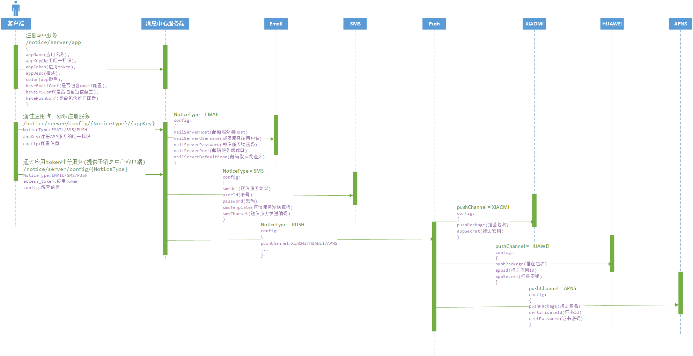
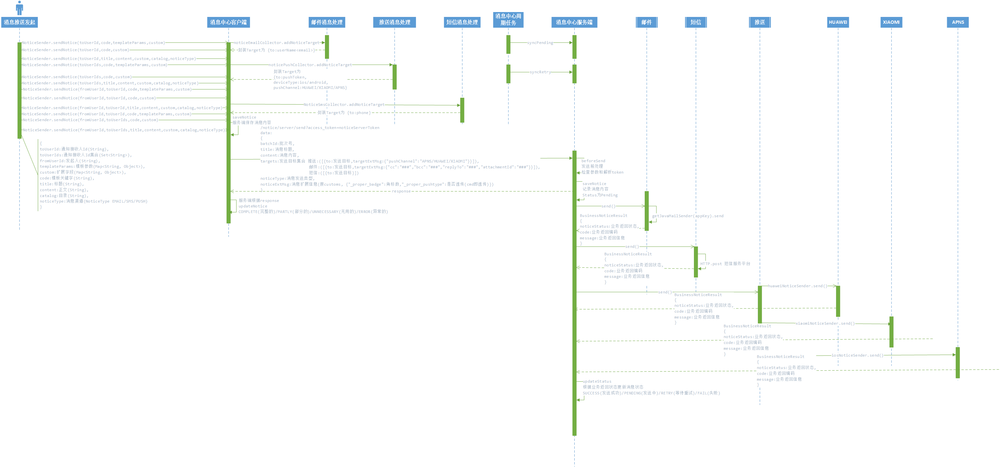
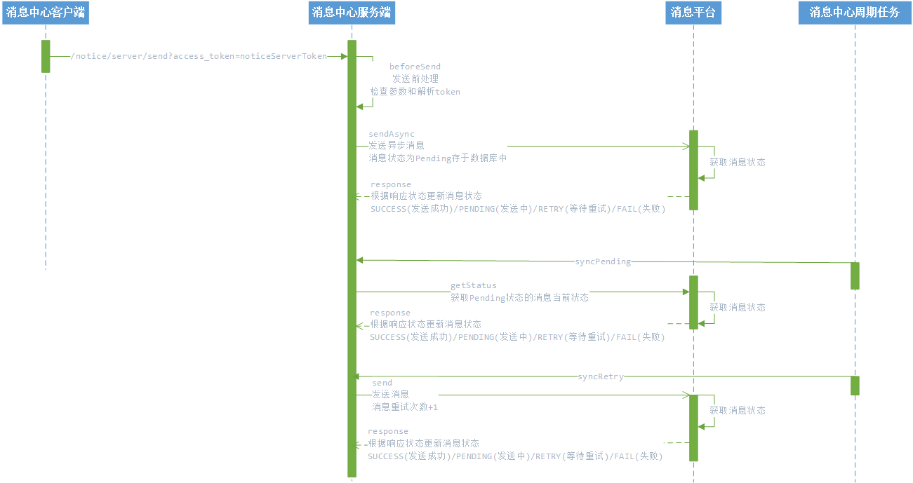

pep-notice
============
Proper Enterprise Platform

# 消息中心

#### `pep-notice-sdk` 为消息中心基础集成包。

#### `pep-notice-client` 为消息中心客户端。
> 负责消息的处理, 向消息中心服务端进行发送。

#### `pep-notice-server` 为消息中心服务端。
> 负责消息的分发, 先提供向邮件, 短信, 推送服务分发。
> 推送服务包括小米推送, 华为推送, 苹果推送

注册消息中心服务的设计方案

消息发送的设计方案

消息中心最佳实现的设计方案

