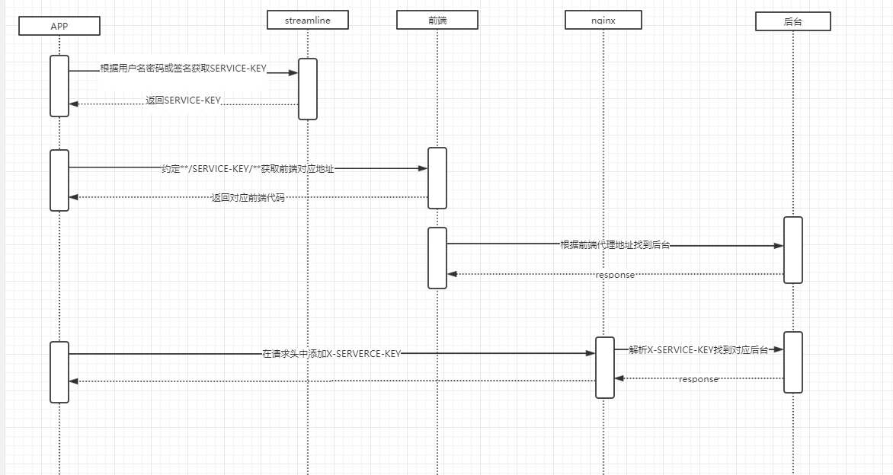

pep-streamline
==============
- SERVICE-KEY是如何生成的
  1. 在用户信息发生变更时，采用切面的方式通过streamline客户端将用户名及密码作为唯一标识与应用编码(SERVICE_KEY)进行关联 
  2. 如果用户认为敏感信息不应存于非本地则可采用手动添加签名和SERVICE-KEY,生成签名和SERVICE-KEY的对应关系
  
- 移动端如何通过streamline找到对应前台
  1. 根据用户名密码或签名获取SERVICE-KEY
  2. 根据约定从**/SERVICE-KEY/**获取前端对应地址

  
- 移动端如何通过streamline找到对应后台
  1. 根据用户名密码或签名获取SERVICE-KEY
  2. 在移动端登录时首先访问streamline获得用户对应的SERVICE_KEY
  3. 以后移动端每次请求后台都带有SERVICE_KEY
  4. 利用ngx对SERVICE_KEY进行解析并指向对应的服务器
  
  

Proper Enterprise Platform
